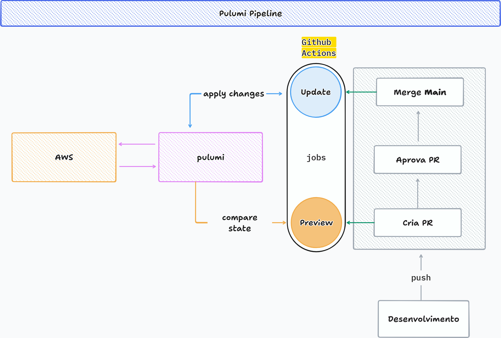

# Infraestrutura AWS com Pulumi e TypeScript

Projeto de Infrastructure as Code (IaC) desenvolvido com Pulumi e TypeScript. Atualmente, ele provisiona recursos na AWS, incluindo:

- um bucket Amazon S3;
- um repositório Amazon ECR;
- tags para identificar os recursos gerenciados por IaC.

## Fluxo da pipeline



O fluxo de entrega da infraestrutura começa no desenvolvimento e segue estas etapas:

1. O código é enviado (`push`) para o GitHub e uma pull request é criada.
2. A criação ou atualização da PR aciona o job [**Preview**](.github/workflows/pr.yaml) no GitHub Actions.
3. O Pulumi compara o código da PR com o estado atual da stack e apresenta os recursos que seriam criados, alterados ou removidos, sem aplicar as mudanças na AWS.
4. Após a revisão e aprovação, a PR é integrada à branch principal.
5. O merge aciona o job [**Update**](.github/workflows/main.yml), que executa as mudanças aprovadas.
6. O Pulumi atualiza os recursos na AWS e registra o novo estado da infraestrutura.

Essa separação permite revisar o impacto das mudanças antes do deploy: o **Preview** funciona como uma etapa de validação, enquanto o **Update** efetivamente aplica a infraestrutura.

## Pré-requisitos

Antes de começar, instale:

- [Node.js 24 ou superior](https://nodejs.org/);
- [pnpm 10 ou superior](https://pnpm.io/installation);
- [Pulumi CLI 3 ou superior](https://www.pulumi.com/docs/iac/download-install/);
- [AWS CLI v2](https://docs.aws.amazon.com/cli/latest/userguide/getting-started-install.html).

Confirme as instalações:  

```bash
node --version
pnpm --version
pulumi version
aws --version
```

## Preparação do projeto

Após clonar o repositório, instale as dependências:

```bash
pnpm install
```

O projeto já está inicializado, portanto não é necessário executar `pulumi new`. Para iniciar um projeto semelhante do zero, use:

```bash
pulumi new aws-typescript
```

## Autenticação no Pulumi

### Pulumi Cloud

Crie uma conta no [Pulumi Cloud](https://app.pulumi.com/) e faça login:

```bash
pulumi login
```

O comando abrirá o navegador para concluir a autenticação. Para ambientes sem interface gráfica ou para automações, crie um access token nas configurações da sua conta e defina:

```bash
export PULUMI_ACCESS_TOKEN="<seu-token>"
pulumi login
```

Não salve o token no repositório. Em CI/CD, armazene-o como um secret chamado `PULUMI_ACCESS_TOKEN`.

### Backend local (opcional)

Caso não queira utilizar o Pulumi Cloud, é possível guardar o estado localmente:

```bash
pulumi login --local
```

O estado local não é compartilhado automaticamente com a equipe e deve ser protegido por backup.

## Configuração da stack

Liste as stacks disponíveis:

```bash
pulumi stack ls
```

Selecione a stack de staging existente:

```bash
pulumi stack select stg
```

Se ela ainda não existir no backend em que você fez login, crie-a:

```bash
pulumi stack init stg
```

Configure a região da AWS:

```bash
pulumi config set aws:region us-east-1
```

Confira a stack ativa e suas configurações:

```bash
pulumi stack
pulumi config
```

## Autenticação na AWS

O Pulumi utiliza a cadeia padrão de credenciais da AWS. Escolha uma das opções abaixo e valide a sessão antes de executar o deploy.

### Opção 1: perfil configurado com AWS CLI

Configure um perfil:

```bash
aws configure --profile pulumi
```

Informe o Access Key ID, o Secret Access Key, a região padrão e o formato de saída. Depois, ative o perfil na sessão atual:

```bash
export AWS_PROFILE=pulumi
export AWS_REGION=us-east-1
```

### Opção 2: AWS IAM Identity Center (SSO)

Configure e autentique o perfil:

```bash
aws configure sso --profile pulumi-sso
aws sso login --profile pulumi-sso
export AWS_PROFILE=pulumi-sso
export AWS_REGION=us-east-1
```

Quando a sessão expirar, execute novamente `aws sso login`.

### Opção 3: variáveis de ambiente

Para credenciais temporárias, exporte as variáveis na sessão atual:

```bash
export AWS_ACCESS_KEY_ID="<access-key-id>"
export AWS_SECRET_ACCESS_KEY="<secret-access-key>"
export AWS_SESSION_TOKEN="<session-token>"
export AWS_REGION="us-east-1"
```

`AWS_SESSION_TOKEN` é necessário para credenciais temporárias e pode ser omitido ao usar credenciais permanentes. Evite registrar credenciais em arquivos versionados ou no histórico do terminal.

### Validar a identidade AWS

Independentemente da opção escolhida, confirme a conta e a identidade utilizadas:

```bash
aws sts get-caller-identity
aws configure list
```

Essa verificação ajuda a evitar a criação de recursos na conta ou região errada.

## Visualizar e aplicar a infraestrutura

Revise as alterações propostas:

```bash
pulumi preview
```

Depois, aplique-as:

```bash
pulumi up
```

Confirme os outputs criados:

```bash
pulumi stack output
```

## Destruir a infraestrutura

Para remover os recursos gerenciados pela stack:

```bash
pulumi destroy
```

Depois de confirmar que todos os recursos foram removidos, a stack também pode ser excluída:

```bash
pulumi stack rm stg
```

Revise cuidadosamente a stack e a conta AWS ativas antes de executar esses comandos.

## Estrutura do projeto

- `Pulumi.yaml`: metadados e runtime do projeto;
- `Pulumi.stg.yaml`: configurações da stack `stg`;
- `index.ts`: definição dos recursos AWS;
- `package.json`: dependências Node.js;
- `tsconfig.json`: configuração do TypeScript;
- `.github/workflows/pr.yaml`: preview do Pulumi em pull requests.

## CI/CD

O workflow de pull request executa `pulumi preview`. Para utilizá-lo, configure os seguintes secrets no GitHub:

- `PULUMI_ACCESS_TOKEN`;
- `AWS_ACCESS_KEY_ID`;
- `AWS_SECRET_ACCESS_KEY`;
- `AWS_REGION`.

Em ambientes de produção, prefira autenticação AWS via OIDC e credenciais temporárias em vez de access keys de longa duração.

## Solução de problemas

- `No valid credential sources found`: valide a sessão com `aws sts get-caller-identity` e confira `AWS_PROFILE`.
- `stack ... not found`: execute `pulumi stack ls` e selecione ou crie a stack correta.
- `PULUMI_ACCESS_TOKEN must be set`: execute `pulumi login` ou exporte um token válido.
- Região incorreta: compare `pulumi config get aws:region`, `AWS_REGION` e `aws configure list`.

Consulte também a [documentação do Pulumi para AWS](https://www.pulumi.com/docs/iac/clouds/aws/get-started/) e a [documentação da AWS CLI](https://docs.aws.amazon.com/cli/latest/userguide/cli-chap-authentication.html).
